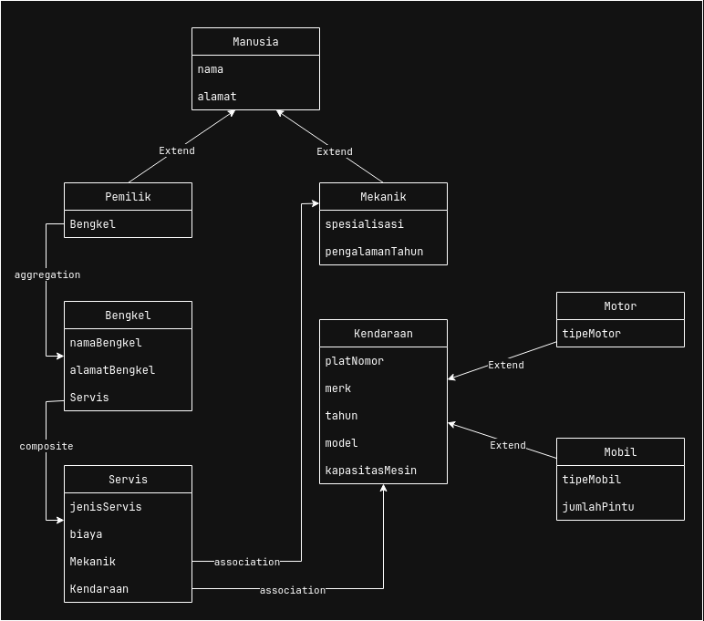
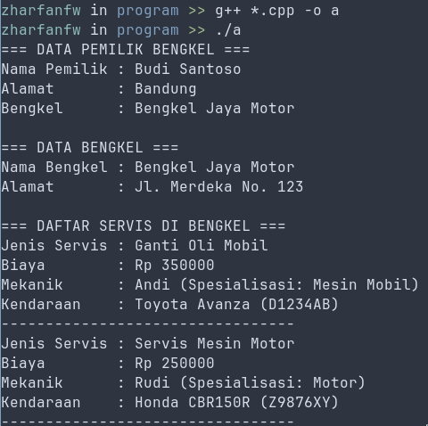
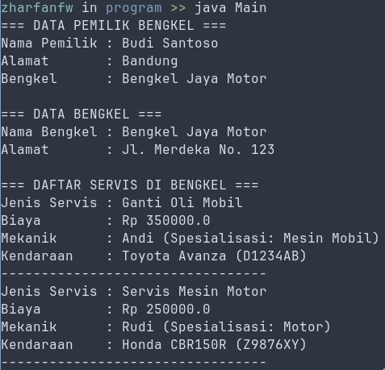
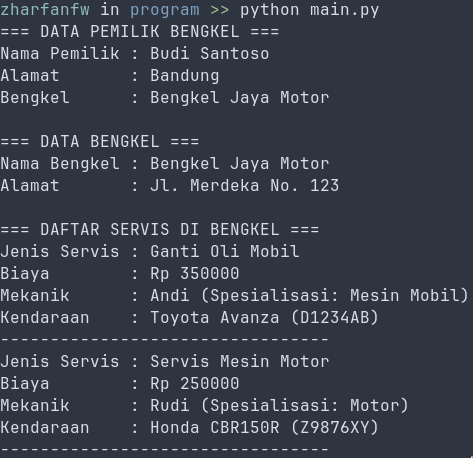

# Tugas Praktikum DPBO - Studi Kasus Bengkel

Tugas ini dibuat untuk memenuhi salah satu tugas mata kuliah Desain dan Pemrograman Berorientasi Objek.

# Janji

Saya, Zharfan Faza Wibwa dengan NIM 2403995, mengerjakan Tugas Praktikum 3 dalam mata kuliah Desain dan Pemrograman Berorientasi Objek untuk keberkahan-Nya. Maka saya tidak melakukan kecurangan seperti yang telah dispesifikasikan. Aamiin.

# Diagram

    

## Desain Program dan Class

Program ini dirancang untuk menyimulasikan sistem manajemen sederhana pada sebuah bengkel kendaraan. Desain program ini menerapkan beberapa konsep PBO seperti _Inheritance_ dan _Composition_.

1.  **Struktur Inheritance Hirarkis**
    Terdapat dua struktur pewarisan (inheritance) utama dalam program ini:
    - **Manusia:** Kelas ini menjadi basis (superclass) untuk kelas `Mekanik` dan `Pemilik`. Hal ini dikarenakan seorang mekanik dan pemilik sama-sama merupakan "manusia" yang memiliki atribut dasar seperti nama dan alamat.
    - **Kendaraan:** Kelas ini menjadi basis untuk kelas `Mobil` dan `Motor`. Desain ini dipilih karena mobil dan motor adalah jenis "kendaraan" yang berbagi atribut umum seperti plat nomor, merk, tahun, dan model.

2.  **Struktur Komposisi (Composition)**
    Relasi "has-a" atau komposisi digunakan untuk menggambarkan kepemilikan atau hubungan antar objek:
    - **Bengkel dan Servis:** Sebuah `Bengkel` "memiliki" (`has-a`) daftar `Servis`. Ini berarti objek `Bengkel` menampung banyak objek `Servis` di dalamnya (menggunakan `std::vector` di C++ atau `list` di Python). Tanpa bengkel, catatan servis tidak akan terorganisir.
    - **Servis, Mekanik, dan Kendaraan:** Sebuah `Servis` "memiliki" satu `Mekanik` dan satu `Kendaraan`. Relasi ini menggambarkan bahwa setiap transaksi servis pasti melibatkan seorang mekanik yang mengerjakan sebuah kendaraan.
    - **Pemilik dan Bengkel:** Sebuah `Pemilik` "memiliki" sebuah `Bengkel`, merepresentasikan hubungan kepemilikan bengkel tersebut.

3.  **Tujuan Desain**
    Dengan memisahkan `Manusia` dan `Kendaraan` sebagai kelas dasar, program menjadi lebih mudah untuk dikembangkan di masa depan (misalnya, menambahkan tipe manusia baru seperti `Kasir` atau tipe kendaraan baru seperti `Truk`). Penggunaan komposisi juga memastikan bahwa hubungan antar objek logis dan terstruktur dengan baik, meniru hubungan di dunia nyata.

# Alur Main Program

Dalam fungsi `main`, alur program berjalan sebagai berikut:

1.  Objek-objek utama dibuat terlebih dahulu, yaitu `Bengkel` dan `Pemilik` yang saling terhubung.
2.  Selanjutnya, dibuat beberapa objek `Mekanik` yang akan bekerja di bengkel.
3.  Kemudian, dibuat objek-objek `Kendaraan` (terdiri dari `Mobil` dan `Motor`) yang akan diservis.
4.  Setelah semua objek pendukung siap, objek `Servis` dibuat. Setiap objek `Servis` menghubungkan satu `Mekanik` dengan satu `Kendaraan`.
5.  Objek-objek `Servis` yang telah dibuat kemudian ditambahkan ke dalam daftar servis milik objek `Bengkel`.
6.  Terakhir, program menampilkan semua informasi secara terstruktur, dimulai dari data pemilik, data bengkel, hingga rincian setiap servis yang ada di dalam bengkel tersebut.

# Format Output

Output program menampilkan data secara hierarkis. Pertama, data pemilik dan bengkelnya ditampilkan. Kemudian, program akan melakukan iterasi melalui daftar servis yang ada di dalam bengkel dan mencetak detail dari setiap transaksi servis, termasuk jenis servis, biaya, mekanik yang mengerjakan, dan kendaraan yang diservis.

# Screenshot

**CPP**

    

**Java**

    

**Python**

    

